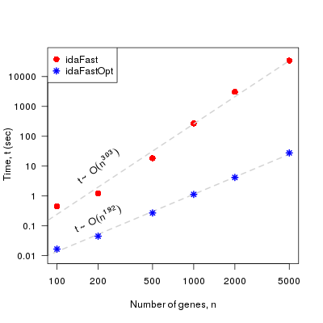

# Pcalg fork

## Description 

 This is a fork from the `R` package `pcalg` 
that implements a `C++` optimization of the 
function idaFast, idaFastOpt. Using `C++` together
with the `Armadillo` library instead of `R` improves the 
performance already. On top of that, the new implementation
seems to have reduced the complexity of the algorithm (see 
Details and Benchmarks). 

* **Patch file**:  `dataOpt/patch_pcalg.txt`
 

### Details

Given a *completed partially directed acyclic graph* `pdag`, and
a given node `x`, we identify the unique parents `uniq_pa`  and the 
ambiguous parents `amb_pa`. From the set of `amb_pa`, we direct them 
in all possible ways (`2``|amb_pa|`) checking first that 
they introduce no new colliders. This implementation differs with 
the original implementation in how "all possible ways" are examined. 

* **Original code:** A loop from 1 to the number of elements
in `amb_pa`, `|amb_pa|` is executed, and the function,
 
   ``pa.tmp <- combn(amb_pa,i,simplify = TRUE)``

   is called where `i` is the variable in the loop. All sets of size `i` in `amb_pa`
are obtained. For every set, all parents in it are directed towards 
`x`, the ones not in it  outwards. If the configuration does not introduce a new 
collider, the causal effects are computed, nothing is done otherwise. 

* **Optimization:** A loop from 0 until  `2``|amb_pa| - 1` is executed, 
where binary representation of `i` (loop variable, `long int`) is sweeping 
over the half posibilities. For every `i` we create two subsets 
`pa_1` and `pa_2` complementary to each other. `pa_1` (`pa_2`) contains the `jth` element
of `amb_pa` if the `jth` bit of `i` is 1 (0).  In that way, we have covered all 
possibilities if we first set `pa_1` to be directed towards `x`, `pa_2` outwards, 
check for colliders, compute causal effects and then do the same reversing the roles
of `pa_1` and `pa_2.`

 

### Benchmarks 

 Comparison of performance of  `idaFast` (original function of the package)
versus our implementation, `idaFastOpt`. We have used  real data and created **cpdag** of
100,200,500,1000,5000 nodes. `idaFast` and `idaFastOpt` have then been run on these
graphs on a Intel(R) Xeon(R) CPU E5-4620 0 @ 2.20GHz. In the graph below, we can see 
the performance of the two functions, in a log-log scale. 

We see not only that the runtime is significantly reduced, but also, and 
for the **cpdag** we were testing the functions on, `idaFast` seemed to scale like 
`O(n``3``)` whereas `idaFastOpt` like `O(n``2``)`. Note that 
the scaling  is not generalizable to all types of graphs. For different input graphs, 
one can expect a different complexity. Nevertheless, it seems that the new implementation
has reduced it.  

  

## Usage

``idaFastOpt(x.pos.set = 1:N, mcov = cov(subDat), graphEst = l$cpdag_graph)``

* **Arguments:** 
   - `x.pos.set`: (integer vector) optional argument. 
   Nodes on which the causal effects are going to 
   be computed. If not passed, the function computes 
   the causal effects on all nodes. Note a vector of positions
   of the target variables is not passed as an argument, in contrast 
   to `idaFast` since in this function all nodes are going to be 
   targets.
   - `mcov`: covariance matrix that was used to estimate `graphEst`
   - `graphEst`: estimated **cpdag** from the function `pc`. If the output of
   `pc` is `pc.fit`, then the estimated **cpdag** can be obtained by
   `pc.fit@graph`.

* **Output:**
   list of causal values; one list element (matrix) for each element of 
   `x.pos.set`

## Tests 

  In the folder `dataOpt`, one can find a code example in `run_idaFast.R`, 
  where both functions, `idaFast`, `idaFastOpt`, are run for the **cpdag**'s
  contained in `dataOpt/skeletonfiles`, and a profiling is performed. 

  In the same folder, the script `benchmarks.R` creates the plot shown in this README.md 
  file.
